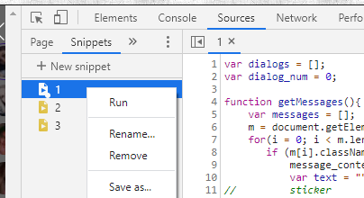

# Badoo dialogs fetching script  
  
## How to run  

1. Go to badoo web site and open messages tab.  

2. Create a new snippet  
  Open developer tools (F12) -> Sources tab -> Snippets -> New snippet

3. Copy our script.js to snippet field and then run this snippet 

  

## How it works  

1. At first we load list of all dialogs with `scrollDialogs` function. To wait when `scrollDialogs` function will finish, we use javascript promises.  

2. After that we iterate through list of dialogs, click to them and load all messages with `getDialog` function. Promises are used to wait to finish all dialogs loading.  

3. Use `downloadObjectAsJson` to download dialogs in json format.
